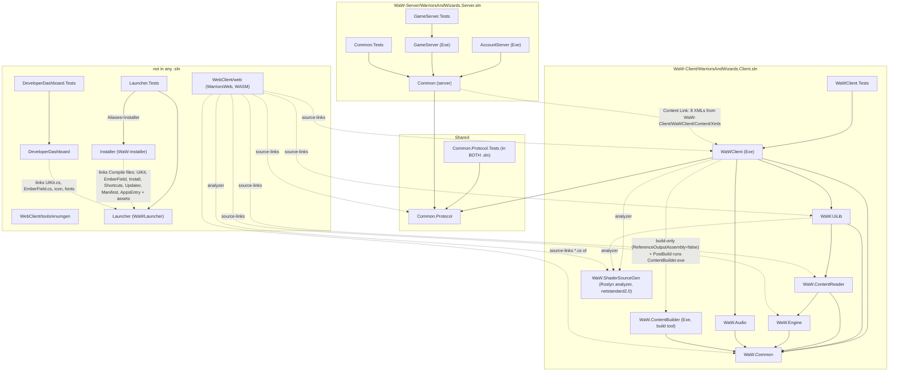
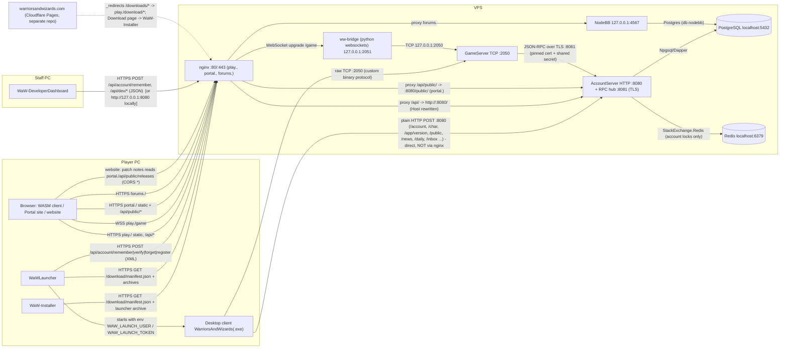

# Dependency Map - Warriors & Wizards (reference source)

This document records how the reference code fits together: which projects build on which, which packages they use, which processes talk to each other, and where the shared data files come from. It describes the code as it is today.

**Conventions**

- **REF** is `C:\Users\cbart\Desktop\Runity\Reference - This Is The Source Being Ported To Unity\Warriors-and-Wizards-Testing`. All paths below are relative to REF.
- Everything was checked against the files on 2026-10-02.
- **UNVERIFIED** marks anything that could not be confirmed from the source alone.
- No secrets or VPS IP addresses are reproduced. "VPS host address" stands for the literal IP that appears in the scripts.

---

## 1. Project reference graph



ASCII summary (solid line = ProjectReference; `~>` = file link, source link or analyzer):
```
WaWClient ─┬─> Common.Protocol            AccountServer ─> Common(server) ─> Common.Protocol
           ├─> WaW.Audio ─> WaW.Common    GameServer    ─> Common(server)
           ├─> WaW.Common                 Common.Tests  ─> Common(server)
           ├─> WaW.UiLib ─┬─> WaW.Common  GameServer.Tests ─> GameServer
           │              └─> WaW.ContentReader ─┬─> WaW.Common
           │                                     └─> WaW.Engine ─> WaW.Common
           ├~> WaW.ContentBuilder (build only, runs as PostBuild exe)
           └~> WaW.ShaderSourceGen (analyzer; also used by UiLib and web)
web.csproj ~> (source) WaW.Common, ContentReader, Engine, UiLib, WaWClient, Common.Protocol
Installer ~> (linked files) Launcher;  DeveloperDashboard ~> (linked files) Launcher
Launcher.Tests -> Launcher, Installer(alias);  DeveloperDashboard.Tests -> DeveloperDashboard
Common(server) ~> (Content Link) WaW-Client/WaWClient/Content/Xmls/*.xml
```

**Notes**

- There is no reference between the client and server solutions except through `Shared/Common.Protocol` and the linked XML files.
- `Launcher` deliberately has no reference to any game project.
- The Launcher, Installer and DeveloperDashboard share code by linking files, not through a library project. The same types are therefore compiled into three assemblies. This is why the tests use `extern alias installer`.

---

## 2. NuGet and third-party packages

The "Replacement" column says what takes the package's place after the move. "C++" means the C++ GameServer. "API" means the Account/API service (C#).

| Package | Version | Used by | Purpose | Replacement |
| --- | --- | --- | --- | --- |
| OpenTK | 5.0.0-pre.16 | WaWClient, WaW.Common, WaW.Engine, WaW.UiLib, enumgen | Window (GLFW), OpenGL 3.3, math | **Unity** (engine). The prerelease dependency goes away. |
| OpenTK.Audio / OpenTK.Core / OpenTK.Mathematics | 5.0.0-pre.16 | WaW.Audio (all three); web (Mathematics) | OpenAL bindings, math | **Unity** AudioSource and Mathematics |
| Silk.NET.OpenAL.Soft.Native | 1.23.1 | WaW.Audio | Native OpenAL Soft binaries (`soft_oal.dll`, `libopenal.so`, `.dylib`) | **Unity** audio |
| NLayer | 1.16.0 | WaW.Audio, web | MP3 decoding | **Unity** (imports mp3 natively) |
| StbVorbisSharp | 1.22.4 | WaW.Audio, web | Ogg decoding | **Unity** |
| ReFuel.StbImage | 2.1.1 | WaW.Common, WaW.Engine | PNG decoding at runtime | **Unity** texture import |
| StbImageSharp | 2.30.16 | WaW.ContentBuilder, web | PNG decoding (build tool and WASM) | **Unity** import |
| StbImageWriteSharp | 1.16.7 | WaW.ContentBuilder | PNG writing (atlases) | **Unity** Sprite Atlas |
| StbRectPackSharp | 1.0.4 | WaW.ContentBuilder | Atlas rectangle packing | **Unity** Sprite Atlas |
| SharpAssimp | 6.0.12 | WaW.ContentBuilder | FBX loading (no FBX content remains) | **Unity** model import; retire |
| msdf-atlas-gen-w64.exe | (bundled binary) | WaW.ContentBuilder | MSDF font atlases | **Unity** TextMeshPro SDF fonts |
| Microsoft.CodeAnalysis.Analyzers / CSharp / CSharp.Workspaces | 5.9.0 | WaW.ShaderSourceGen | Roslyn source generator (GLSL to C#) | Retire (Unity shaders) |
| Microsoft.Extensions.Logging | 10.0.11 | WaWClient, WaW.Audio, WaW.Engine, WaW.UiLib, web | Logging | **Unity** `Debug.Log` or a thin wrapper; API: keep (ASP.NET logging) |
| Microsoft.Extensions.Logging.Console | 10.0.11 | WaWClient, web | Console logger | Unity console / API: keep |
| Microsoft.Extensions.Logging.Abstractions | 10.0.11 | WaW.Common | Logging interfaces | Unity: drop |
| BouncyCastle.Cryptography | 2.7.0 | WaWClient, web | **No `Org.BouncyCastle` usage found** (dead dependency; the audit's F49 RSA.cs is gone) | Drop. If encryption is needed: TLS in Unity (`UnityWebRequest` over HTTPS); C++ OpenSSL. |
| dotnet-mgcb tools | 3.8.1.303 | WaWClient (`.config/dotnet-tools.json`, restored before each build) | MonoGame content tools; no use found (UNVERIFIED) | Retire |
| Npgsql | 9.0.3 | Common (server), used by the AccountServer process only | PostgreSQL driver (`NpgsqlDataSource`, pooled) | **API**: keep (or EF Core plus Npgsql). C++: none (no DB access). |
| Dapper | 2.1.66 | Common (server), 17 files | Micro-ORM | **API**: keep or EF Core |
| StackExchange.Redis | 2.8.31 | Common (`Database/AccountLockManager.cs` only) | Account locks (one session per account) | **API**: keep |
| StreamJsonRpc | 2.25.29 | Common (`Messaging/IpcServer`, `IpcClient`, `Proxies`), AccountServer `AccServerRpcHandler` | GameServer to AccountServer RPC (JSON-RPC over TLS `SslStream`, pinned self-signed certificate plus shared secret) | **Replace** with a protocol C++ can speak: HTTP/JSON or gRPC on localhost. The exact StreamJsonRpc message framing (header-delimited or otherwise) is UNVERIFIED and matters only if wire compatibility is attempted. |
| Newtonsoft.Json | 13.0.3 | Common, AccountServer | JSON (world configs, account JSONB, API answers) | **API**: System.Text.Json. **C++**: nlohmann/json or simdjson. |
| Ionic.Zlib.Core | 1.0.0 | Common (`Resources/World/MapData.cs`), GameServer.Tests | zlib inflate of `.jm` tile data | **C++**: zlib or miniz. Unity: `System.IO.Compression`, if the client ever reads `.jm` files. |
| System.Drawing.Common | 8.0.4 | Common (server) | Only a `using System.Drawing;` in `GameServer/Game/Network/User.cs`; no use found. Windows-only API. | Drop |
| System.Linq.Async | 6.0.1 | Common (server) | Async LINQ (usage UNVERIFIED) | API: built into .NET 10 / drop |
| Microsoft.Extensions.DependencyInjection.Abstractions | 10.0.1 | Common (server) | No usage found | API: ASP.NET DI (built in) |
| MinVer | 7.0.0 | AccountServer, GameServer | Assembly version from git tags (`v` prefix). The REF folder is not a git repo, so the result is presumably the default 0.0.0 version (UNVERIFIED). | CI versioning |
| Microsoft.CodeAnalysis.Common / CSharp | 4.14.0 | GameServer, only with `-p:BehaviorHotReload=true` | Runtime C# compile of behaviours (`/reloadbehaviors`) | Retire (the C++ server can use data-driven or scripted behaviours) |
| Avalonia.Desktop / Avalonia.Fonts.Inter / Avalonia.Themes.Fluent | 12.1.3 | Launcher, Installer, DeveloperDashboard | Cross-platform desktop UI (UI built in code) | **Keep** (these tools are kept) |
| System.Security.Cryptography.ProtectedData | 10.0.0 | Launcher, DeveloperDashboard | Windows DPAPI for the saved sign-in token | Keep |
| xunit | 2.9.3 | all 6 test projects | Tests | Unity Test Framework (NUnit); C++: GoogleTest or Catch2; API: keep xunit |
| xunit.runner.visualstudio | 3.1.4 | all tests | Runner | same as above |
| Microsoft.NET.Test.Sdk | 17.14.1 | all tests | Test host | same as above |
| coverlet.collector | 6.0.4 | all tests | Coverage | same as above |
| Microsoft.NET.Sdk.WebAssembly (+ the `wasm-tools` workload for AOT) | SDK 10.0.x (README: 10.0.400 user-local) | web | WASM build | Unity WebGL (if a browser build is kept) |

**Runtimes, tools and infrastructure**

| Item | Version | Used by | Notes |
| --- | --- | --- | --- |
| .NET SDK | `global.json`: client `10.0.100` (latestMinor), server `10.0.0` (latestMajor, prerelease allowed) | all C# projects | No `global.json` covers the Launcher, Installer, DeveloperDashboard or web projects, so they use whatever SDK is installed. |
| .NET 10 runtime (`dotnet-install.sh --channel 10.0`) | 10.0.x | VPS servers | The servers are framework-dependent `.dll` files run with `/usr/bin/dotnet`. |
| PostgreSQL | 17 locally (README, `Tools/Admin`); the apt default on the VPS (version UNVERIFIED) | AccountServer, NodeBB | localhost:5432; database `alloy` and database `nodebb` |
| Redis | apt `redis-server` on the VPS; Memurai locally | AccountServer | localhost:6379 |
| nginx and certbot (python3-certbot-nginx) | apt | VPS | Three server names: `play`, `portal`, `forums` |
| Python 3 + `websockets` (pip, in a venv) | - | `ww-bridge` on the VPS; WebClient tools | |
| Python 3 + Pillow | - | `Tools/Portal`, `Tools/Editor`, `Tools/Mac` | |
| Playwright + Chrome | - | `WebClient/tools/webtest.py`, `shadercheck.py` | |
| Chrome or Edge | - | `Tools/Editor/tests/run_tests.py` | |
| Node.js 20 + NodeBB v3.x | - | Forums | |
| OpenSSH client, robocopy, tar | - | `deploy.ps1`, `promote.ps1` | |

---

## 3. Runtime dependency graph (processes, ports and protocols)



### 3.1 Connection table

| From | To | Port | Protocol | Purpose | Source of truth |
| --- | --- | --- | --- | --- | --- |
| Desktop client | AccountServer | 8080 | **Plain HTTP**, form POST, XML answers. Uses the VPS host address directly in `TARGET_VPS` builds. | Login, verify, character list, version check, `/public/*` (in-client Portal), news, daily rewards, inbox, skins, slots, music, guild, board | `WaW-Client/WaWClient/Core/Settings.cs` (`AppEngineUrl`), `appEngineConfig.xml` |
| Desktop client | GameServer | 2050 | Raw TCP, custom framing: `int32 LE length` (includes the 5-byte header), `byte id`, body; UTF strings as `uint16 LE` length plus bytes. Packet ids are in `Shared/Common.Protocol/PacketId.cs`. | Gameplay. `Hello` carries version, gameId, username, password or token. | `Settings.cs` (`GameServerPort` 2050), `gameServerConfig.xml`, `Tools/E2E/README.md` |
| GameServer | AccountServer | 8081 | StreamJsonRpc over `SslStream` (TLS), pinned self-signed certificate (`rpc-server.cer`) plus a shared secret | See section 3.2 | `Common/Messaging/*`, `rpcServerConfig.xml`, `rpcClientConfig.xml` |
| AccountServer | PostgreSQL | 5432 | Npgsql | All persistence (13 tables) | `postgresConfig.xml`, `Common/Database/Schema.sql` |
| AccountServer | Redis | 6379 | RESP | Account locks only (`AccountLockManager`) | `redisConfig.xml` |
| GameServer | PostgreSQL / Redis | - | **none** | The GameServer never touches either (verified: no `DbClient` or Redis use under `GameServer/`) | `WaW-Server/AGENTS.md`, grep |
| Browser (WASM client) | nginx `play.` | 443 | HTTPS; `/api/` same-origin; `/game` WSS | Same API and game traffic as the desktop client | `WebClient/web/wwwroot/main.js` (`cfg.api`, `cfg.game`), `setup_web.sh` |
| nginx | AccountServer | 8080 | HTTP; `Host: <ip>:8080` rewrite; `X-Forwarded-For` | `/api/*` (play.) and `/api/public/*` only (portal.) | `setup_web.sh`, `setup_portal.sh` |
| nginx | ww-bridge | 2051 (loopback) | WebSocket | `/game` | `setup_web.sh` |
| ww-bridge | GameServer | 2050 (loopback) | TCP | Relays bytes both ways; **the client's IP is not forwarded** | `WebClient/vps/ws_bridge.py` |
| Launcher | nginx `play.` | 443 | HTTPS GET | `download/manifest.json?t=`, archives (SHA-256 checked) | `Launcher/Engine.cs` (`DefaultDownloadBase`) |
| Launcher | nginx `play.` to AccountServer | 443 to 8080 | HTTPS form POST, XML | `/account/remember`, `/verify`, `/forget`, `/register` | `Launcher/Account.cs` |
| Installer | nginx `play.` | 443 | HTTPS GET | Manifest plus launcher archive | `Installer/Setup.cs` |
| DeveloperDashboard | nginx `play.` to AccountServer | 443 to 8080 | HTTPS form POST, JSON | `/account/remember`, `/account/forget`, `/dev/*` (rank 90+ checked on every call) | `DeveloperDashboard/Api.cs` |
| Portal site (browser) | nginx `portal.` to AccountServer | 443 to 8080 | HTTPS GET, JSON | `/public/online`, `search`, `player`, `guild`, `leaderboard` | `Portal/site/js/portal.js` |
| Website (Cloudflare) | nginx `portal.` | 443 | HTTPS GET, CORS `*` | `/api/public/releases` (patch notes page) | `CLAUDE.md`, `AccountServer/Program.cs:233` |
| NodeBB | PostgreSQL | 5432 | Postgres | Forum data (database `nodebb`) | `Forums/vps/setup_forums.sh` |
| nginx | NodeBB | 4567 (loopback) | HTTP and WebSocket | `forums.` | `setup_forums.sh` |
| Developer PC | VPS | 22 | SSH and scp as **root** | All deploy and ops actions | `deploy.ps1` (`-VpsUser root`) |
| E2E tests | local servers | 2050, 8080 | TCP, HTTP | Regression | `Tools/E2E/*.py` |

### 3.2 RPC methods

The C++ GameServer must provide the GameServer-side methods and call the AccountServer-side methods.

From `WaW-Server/Common/Messaging/Proxies.cs`.

**GameServer-side (the AccountServer calls these)**

- `GlobalAnnouncement`
- `GetGameServer`
- `GetUserInfo`
- `GetStatus`
- `ApplyModeration`
- `GetWeather`
- `SetWeather`

The `/dev/status`, `/dev/moderate` and `/dev/weather` handlers fan out to every connected game server through these calls (`IpcServer.Clients`).

**AccountServer-side (the GameServer calls these)**

| Area | Methods |
| --- | --- |
| Connection and account | `GameServerConnected`, `GetUserInfo`, `VerifyAccount`, `GetActiveBans`, `FlushAccount` |
| Characters | `GetCharacter`, `CreateCharacter`, `SaveCharacter`, `RecordDeath` |
| Moderation | `FindAccount`, `Moderate`, `GetMuteState`, `SendMail`, `FlagSuspect` |
| Storage and gifts | `SaveCampsiteChests`, `LoadGiftChest`, `SaveGiftChest`, `FillGiftChest`, `BuyStorage` |
| Rewards and unlocks | `ClaimStarter`, `UnlockSkin`, `ClaimBounty` |
| Lifecycle | `Close` |

The list is from a grep of `Task` signatures in `Proxies.cs` (about 25 methods). It is not exhaustive for overloads.

### 3.3 AccountServer HTTP endpoints

Every endpoint takes GET or a POST form. Unless noted, answers are XML.

| Area | Endpoints | Notes |
| --- | --- | --- |
| Account | `/account/register`, `/remember`, `/verify`, `/forget`, `/purchaseCharSlot`, `/purchaseSkin` | |
| App | `/app/version` | |
| Characters | `/char/list`, `/delete`, `/fame`, `/chooseRole` | |
| Daily rewards | `/daily/status`, `/claim`, `/spin` | |
| Inbox | `/inbox/list`, `/read`, `/claim`, `/delete` | |
| Guild | `/guild/getBoard`, `/setBoard`, `/listMembers` | |
| Bug board | `/board/list`, `/post`, `/delete`, `/status` | |
| Fame | `/fame/list` | |
| Music | `/music/now`, `/set`, `/skip` | |
| News | `/news/feed` | |
| Developer | `/dev/whoami`, `/status`, `/players`, `/player`, `/moderate`, `/mail`, `/news/list`, `/news/post`, `/news/delete`, `/anticheat`, `/weather` | JSON answers |
| Public | `/public/online`, `/search`, `/player`, `/guild`, `/leaderboard`, `/releases` | JSON answers, CORS `*` |
| Legacy | `/crossdomain.xml` | Flash leftover; the file path is wrong (SourceInventory Discrepancy 7) |

### 3.4 What is exposed to the internet today

These ports are opened by `ufw` in `VPS_SETUP.md` and the setup scripts.

| Port | Service |
| --- | --- |
| 22 | SSH |
| 80 / 443 | nginx |
| 8080 | AccountServer, directly, for the desktop client |
| 2050 | GameServer |

**Must stay closed:** 8081 (RPC), 5432 (Postgres), 6379 (Redis), 4567 (NodeBB) and 2051 (the bridge, which binds 127.0.0.1).

Note that `rpcServerConfig.xml` sets `ListenAddress` to `0.0.0.0` for 8081. Protection therefore relies on the firewall plus TLS and the shared secret.

---

## 4. Build-time data dependencies

| Consumer | Reads | From |
| --- | --- | --- |
| WaWClient PostBuild (`ContentBuilder.exe <ProjectDir> <TargetDir> Content`) | `Content/Content.xml`, `Xmls`, `Sheets`, `Fonts`, `Sound`, `Title`, `Ui`, `*.atlas` | `WaW-Client/WaWClient/Content/` (cached copy in `Content/bin`) |
| `deploy -Client`, `-Linux`, `-Mac` | Built `Content/`, OpenAL natives | `WaW-Client/WaWClient/bin/Release/net10.0/<rid>/` |
| `build_web.py` | Built content | `WaW-Client/WaWClient/bin/Debug/net10.0/Content` (the **Debug** build) |
| `Tools/Portal/build_portal_data.py` | XMLs, `Game.atlas`, sheets, `BuildVersion` | `WaW-Client/WaWClient/Content/...`, `Core/Settings.cs` |
| `Tools/Editor/build_palette.py` | XMLs, atlas, region list, world configs | client Content; `WaW-Server/Common/Resources/World/MapData.cs`; `.../World/Data/Config/*.json` |
| `Tools/Editor/preview_map.py`, `tests/run_tests.py` | `.jm` maps, configs, atlas, sheets | server `Resources/World/Data`; client Content |
| `Tools/E2E/*.py`, `promote.ps1`, `deploy.ps1` | `BuildVersion` | `WaW-Client/WaWClient/Core/Settings.cs` (`deploy.ps1` and `promote.ps1` also read `gameServerConfig.xml <Version>`) |
| `deploy -Launcher`, `-Manifest` | Launcher `<Version>` | `Launcher/Launcher.csproj` (must equal `SelfUpdate.Version`) |
| Launcher, Installer and Dashboard icon | `waw.ico` | `WaW-Client/WaWClient/waw.ico` (conditional `ApplicationIcon`) |

---

## 5. Shared XML content and where each side gets its copy

### 5.1 Where the content lives

**The single source of truth** is `WaW-Client/WaWClient/Content/Xmls/`. It holds eight files:

| File | Size |
| --- | --- |
| `Containers.xml` | 6 KB |
| `Equip.xml` | 77 KB |
| `Ground.xml` | 41 KB |
| `NPCs.xml` | 66 B |
| `Objects.xml` | 93 KB |
| `Players.xml` | 8 KB |
| `Projectiles.xml` | 1 KB |
| `StaticObjects.xml` | 5 KB |

### 5.2 How each consumer gets its copy

**Desktop client**
- The ContentBuilder's `Copy` builder (`<Folder ext="*.xml">Xmls</Folder>` in `Content.xml`) copies the XMLs into `bin/<cfg>/net10.0[/<rid>]/Content/Xmls`.
- `deploy` copies that `Content` folder next to the published single-file exe.
- The XMLs are loaded at runtime from `Content/Xmls`. The client loads them in parallel, so class-list order is not fixed (`CLAUDE.md`).

**Browser client**
- `build_web.py` copies the **built** desktop `Content` (Debug) into the site's `content/` and writes `content.json`.
- The browser downloads them at start (`wwwroot/main.js`).

**Server**
- `WaW-Server/Common/Common.csproj` has eight `<Content Include="..\..\WaW-Client\WaWClient\Content\Xmls\X.xml" Link="Resources\Xml\Data\Xmls\X.xml" CopyToOutputDirectory="PreserveNewest">` items.
- The **server build copies the client's files** into `bin/.../Resources/Xml/Data/Xmls/`.
- `WaW-Server/Common/Resources/Xml/Data/` in source is **empty**. `gameServerConfig.xml` and `appEngineConfig.xml` `<XmlsDir>Resources/Xml/Data/</XmlsDir>` point at the output copy.
- `deploy -Server` ships them inside `WaW-Server.tgz` to `/opt/alloy-server/Resources/Xml/Data/Xmls`.
- Per `CLAUDE.md`, the server loads **every** `*.xml` it finds there, so stale copies in `bin` cause trouble.

**Portal and Editor tools**
- They read the client source folder directly.

**Server-only content (not shared)**

| Content | Location |
| --- | --- |
| Merchants | `Resources/Xml/Merchants/NexusMerchants.xml` |
| Maps | `.jm` files under `Resources/World/Data` |
| World configs | `*.json` under `Resources/World/Data/Config` |
| News, patch notes, daily rewards | `.txt` files |
| Server configs | All config XMLs |

The client receives map data over the network. No `.jm` files exist under the client Content folder. Whether the client can also load a `.jm` file locally is UNVERIFIED.

### 5.3 Code-level shared data

| Shared item | Where it lives | Notes |
| --- | --- | --- |
| Packet ids | `Shared/Common.Protocol/PacketId.cs` | Compiled into both sides |
| Shared rules | `Shared/Common.Protocol`: `LevelRules`, `InventoryLayout`, `ItemCategories`, `Roles`, `WorldIds`, `Bounties`, `NexusCats`, `PowerUpList`, `WorldPosData` | Compiled into both sides |
| `StatsType` enum | Kept separately on each side | The two enums differ after 82; string stats must be listed in three places (`CLAUDE.md`). Parity is enforced only by convention and tests. |
| Version | `Core/Settings.cs` `BuildVersion` and `gameServerConfig.xml <Version>` | Kept equal by `deploy -SetVersion`; the GameServer refuses mismatches |
| `ItemCategories` rules | `Shared/Common.Protocol/ItemCategories.cs` and `Tools/Portal/build_portal_data.py` (`category_of`) | Duplicated |

### 5.4 Implication for the migration

- Move the XMLs (and the maps and world configs) into a neutral `content/` source that all consumers read: the Unity importer, the C++ GameServer loader, the Portal tool and the Editor. This replaces the client-folder-as-truth plus csproj-link arrangement.
- Generate the packet, stat and enum tables for C# (Unity) and C++ from one schema, so client-server parity is checked rather than conventional.

---

## 6. Discrepancies

The full list is in `SourceInventory.md` section 8. These are the ones about dependencies and runtime:

1. **EngineeringAudit F49 vs the csproj files:**
   - Google.Protobuf and Grpc are no longer referenced (removed 2026-09-21).
   - BouncyCastle is still referenced by `WaWClient.csproj` and `web.csproj`, but no `Org.BouncyCastle` code remains. The audit names `RSA.cs` as the user, and that file is gone.
   - `System.Drawing.Common` is still referenced, but the only trace is an unused `using System.Drawing;` in GameServer `User.cs`.
   - `Microsoft.Extensions.DependencyInjection.Abstractions` (server Common) has no usage found. It is not mentioned by the audit.
2. **EngineeringAudit 1.1** says `Shared/Common.Protocol` has "2 files: LevelRules, WorldPosData". It now has 10 files, including `PacketId`. `WaW-Server/AGENTS.md` lists 3 of them.
3. **EngineeringAudit 1.6** lists 8 tables. `Schema.sql` has 13.
4. **CLAUDE.md:** "every browser player's real address arrives via nginx `X-Forwarded-For`". This is true for `/api/` HTTP only. On the game port, `ws_bridge.py` connects from 127.0.0.1 and passes no address. `gameServerConfig.xml` confirms that the bridge's 127.0.0.1 is exempt from the per-IP cap, so per-IP limits on 2050 do not apply to browser players.
5. **ws_bridge docstring** calls the script a "local stand-in for the VPS's websockify". `setup_web.sh` installs this same script as the production `ww-bridge`, and no websockify exists.
6. **README.md** says the client "is configured for 127.0.0.1" and that deploy swaps in the VPS address. That is accurate, but no document notes that the desktop client then talks to the AccountServer over **plain HTTP on 8080 across the internet**. Only the launcher and dashboard use HTTPS through nginx.
7. **`/crossdomain.xml`:** the csproj copies `Handlers\Crossdomain\crossdomain.xml` and the handler reads that path, but the file lives in `AccountServer/Systems/Crossdomain/`.
8. **Version sources:** MinVer (git tags) versions the server assemblies, but REF is not a git repository. The game protocol version is the separate `gameServerConfig.xml <Version>`. The assembly version is therefore meaningless in this copy (UNVERIFIED what MinVer emits without git).
9. **SDK pinning:** `README.md` says ".NET 10 SDK (pinned by `global.json` in each solution)". The two pins differ: the client uses `10.0.100` latestMinor; the server uses `10.0.0` latestMajor with prerelease allowed. The Launcher, Installer, Dashboard and web projects have no pin.
10. **`build_web.py`** uses the Debug content build (`bin/Debug/net10.0/Content`), while the desktop releases use Release content. Normally these are identical copies; this is noted only as a hidden coupling.
